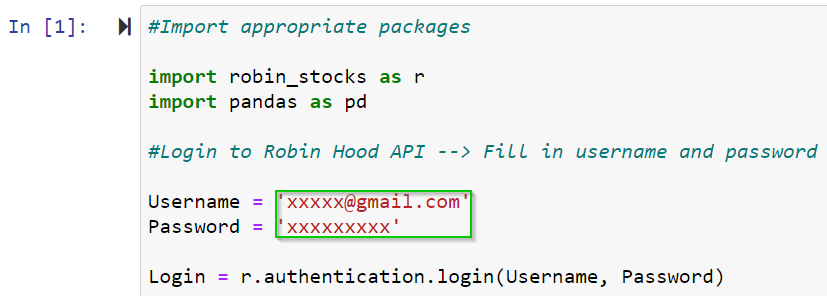

# ROBIN_HOOD_TO_FACTSET
Python script for pulling transactions from Robin Hood and formatting them in FactSet friendly upload format

The purpose of this python script is to build a list of daily holdings from a downloaded RobinHood transaction file. FactSet applications (PA3) can only read and use holdings data when it is stated on a daily basis in a cumulative sum format. Even if there was no trade on a particular date, the symbol and quantity held must be displayed on that date. 

The python script will translate any buys to a positive quantity and any sales to a negative quantity so that during daily summation, the buys will be added to the total quantity per symbol and the sales will be subtracted.

To run the script, you will need to input three pieces of information. 1.) RobinHood Username, 2.) RobinHood Password, 3.) Your Jupyter Notebooks directory folder 

###Step 1+2:

The RobinHood information will need to be placed here:

