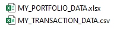

# ROBIN_HOOD_TO_FACTSET ReadMe
This is a python script for pulling transactions from Robin Hood and formatting them in FactSet friendly upload format

The purpose of this python script is to build a list of daily holdings from a downloaded RobinHood transaction file. FactSet applications (PA3) can only read and use holdings data when it is stated on a daily basis in a cumulative sum format. Even if there was no trade on a particular date, the symbol and quantity held must be displayed on that date. 

The python script will translate any buys to a positive quantity and any sales to a negative quantity so that during daily summation, the buys will be added to the total quantity per symbol and the sales will be subtracted.

The script leverages the Robin_Stocks python library. More information on that library can be found here: https://robin-stocks.readthedocs.io/en/latest/functions.html

The script also leverages the Pandas python library. This is a common library and information can be found anywhere. 

To run the script, you will need to input three pieces of information. 1.) RobinHood Username, 2.) RobinHood Password, 3.) Your Jupyter Notebooks directory folder 

### Step 1: 
Input RobinHood login info. The RobinHood information will need to be placed here:

### Step 2: 
Specify the appropriate folder where your Jupyter Notebook directory is placed. Normally it will be your specific user folder in the "Users" folder of the C drive. For example, mine is C:\Users\ksmith02. However, this can differ if you have manually changed it. You can tell what folder it is from the Anaconda startup window:

Here is where you will need to specify the folder in the script:

### Step 3:
You should be all set to run the script now. To run, all you need to do is either click into each cell one by one and hit SHIFT + ENTER or click on the "Cell" tab and then select "Run All". Note that the "Run All" method is the easiest way. If you choose to click into each cell and hit SHIFT + ENTER, you will need to what for each cell to finish running before running the next cell.

### Final Product:
Now in your Jupyter Notebook directory folder, you will see two Excel files, one entitled MY_TRANSACTION_DATA.CSV and another entitled MY_PORTFOLIO_DATA.XLSX:

The transaction file is what was pulled from your RobinHood account using the Robin_Stocks python library. The portfolio file is the FactSet formatted holdings data ready for upload via FactSet's Data Central (@DC2) application. 
